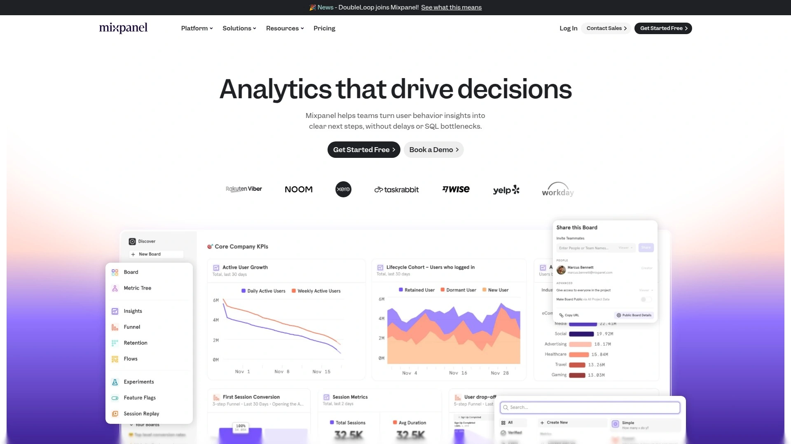

# 最新隐私保护网站分析工具汇总(内附功能对比)

Google Analytics让你在欧洲和加州市场丢掉29%-50%的访客数据,因为拒绝cookie横幅的用户根本不会被统计进去。广告拦截器直接屏蔽GA脚本,GDPR罚款动不动几十万欧元,法务团队天天催你整改数据合规问题。更要命的是GA4的复杂仪表盘让营销团队每周浪费好几个小时,却还是看不懂数据到底在说什么。隐私保护型网站分析工具正在改变这个困境——它们不需要cookie横幅就能追踪100%访客,自动符合GDPR/CCPA/PECR等全球法规,数据完全由你掌控不会被第三方转卖。这份榜单按实际使用价值排序,从免费开源到企业级方案都有覆盖,帮你找到既能获取完整数据又不会触犯隐私法规的分析平台。

## **[Wide Angle Analytics](https://wideangle.co)**

专为营销人员设计的隐私优先分析工具,无需cookie横幅即可追踪全部访客,德国公司严格遵守欧盟法规。

Wide Angle的核心优势是让你看到所有网站访客,而不需要复杂设置或技术知识。与Google Analytics不同,它显示你的全部网站流量,无需cookie同意横幅。传统分析工具会产生盲点——29%-50%的访客对它们完全不可见,cookie同意拒绝会在流量数据中造成显著缺口,复杂仪表盘每周浪费营销团队好几小时。

Wide Angle构建了一个功能丰富的分析套件,但使用起来很简单。追踪所有网站访客而不需要侵入性cookie同意,获得专为营销人员设计的清晰洞察而非数据科学家,基于完整数据而非部分样本做决策,保持完全GDPR合规而不牺牲数据质量。所有数据专门托管在欧洲服务器上,德国公司受严格的欧盟数据法律约束,任何情况下不与第三方共享数据,自动IP匿名化且不收集个人数据。

无cookie追踪技术能捕获使用广告拦截器的访客,这些人对传统分析工具完全隐形。识别回访用户时不使用侵犯隐私的方法,跨所有设备和浏览器工作无例外。简洁专注的仪表盘,只关注真正重要的指标,用干净无杂乱的报告专为营销决策设计。团队协作工具能与客户和团队成员分享自定义报告,为每个网站提供精确权限控制。

提供灵活的追踪选项——根据具体业务需求在无cookie追踪或高级指纹识别之间选择。默认设置不需要cookie同意横幅,为访客提供更干净、无挫折的网站体验。WordPress、Squarespace、Wix、Ghost、Webflow等主流平台都有一键插件,自定义网站添加追踪代码少于5分钟,大多数客户无需任何技术协助就能完成设置。

## **[Matomo](https://matomo.org)**

开源隐私分析平台的老大哥,超过100万网站使用,支持云端托管和本地部署。

Matomo被超过100万个网站信任,隐私保护做得如此出色,配置好后可以追踪100%的访客而不需要同意屏幕的杂乱。法国数据保护机构已确认Matomo在法国免于追踪同意要求,用户安心知道他们可以维护GDPR并在不需要追踪同意的情况下收集数据。

Matomo不使用指纹识别追踪访客,因为它不像人们想的那样隐私友好,可能违反GDPR法规。相反,它使用访客config_id——一个随机种子的、隐私启用的、时间限制的访客设置和属性有限集合的哈希。config_id或config哈希是基于访客的操作系统、浏览器、浏览器插件、IP地址和浏览器语言为访客计算的字符串。

作为Google Analytics的无cookie替代方案,Matomo的优势包括:获得最隐私友好的行业领先措施来保护用户隐私,数据存储在分析工具的服务器上而不是用户设备上,100%准确的网络流量数据。通过Matomo无cookie追踪,你可以自信地依赖收集的所有数据并保护用户隐私。

云端托管从每月23欧元起,最多5万次点击,还有免费的开源自托管选项。如果你的团队有技术能力自行托管,Matomo能给你完全的数据控制权。

## **[Plausible Analytics](https://plausible.io)**

轻量级隐私分析工具,脚本大小不到1KB,加载速度比GA快75倍。

Plausible的分析脚本比GA小超过75倍。实际上,一个X用户声称一旦他们从网站移除GA并切换到Plausible,网站的Core Web Vitals报告从70(需要改进)跳到96(良好)。像Matomo一样,它是开源替代方案,但Plausible面向非技术用户。易于使用,可以立即在仪表盘内访问网站性能洞察。

在单个仪表盘中追踪独特访客、总访问、总页面浏览等指标。软件的美妙之处在于你不必浪费时间设置与网站性能相关的基本报告。例如,你可以接入Google Search Console,Plausible会将数据填充到仪表盘中。

最大的区别是Plausible是真正不收集cookie或个人数据的少数工具之一。因此,你自动符合GDPR、CCPA、PECR等法规。由于你不收集个人数据,不必显示cookie同意横幅,这帮助你提供更好的用户体验。广告拦截器倾向于使用基于cookie的脚本来识别要拦截哪些应用,Plausible不使用这些脚本,所以你可以不受干扰地测量访客参与度。

托管在欧盟,由欧洲拥有的云基础设施提供支持,完全独立、自筹资金和自力更生。最小化数据收集,不收集个人数据,所有数据仅以聚合形式存在,不跨设备追踪,不跨网站和应用追踪,所有数据隔离到单日。你100%拥有你的网站数据,数据不会发送、共享或出售给任何第三方。

每月9美元起,最多1万次页面浏览。提供30天免费试用,可以自托管Plausible Analytics。

## **[Fathom Analytics](https://usefathom.com)**

纯粹简洁的隐私分析工具,2018年推出后迅速成为在线企业的热门选择。

Fathom Analytics是隐私中心的网络分析工具,提供简单有用的统计数据,而不追踪或存储网站访客的个人数据。完全符合GDPR、ePrivacy(PECR)、COPPA和CCPA,不使用广告cookie。提供实时分析,让你看到任何给定时刻有多少人在你的网站上以及他们在做什么。

仪表盘简洁易导航,专注于以可理解的方式呈现最重要的数据。数据保留时间无限,允许你分析长期趋势和模式。所有网站视图功能能一次看到最多12个网站的重要网站流量指标概览。

允许你同时切换多个指标,非常适合交叉比较而不需要来回切换。虽然UI稍微混乱一些,但能在一个视图中看到所有数据而不需要来回切换非常方便。Fathom还提供正常运行时间监控功能,虽然不一定是决定性因素,但性价比更高。

每月15美元起,最多10万次页面浏览,包含无限网站。如果你只是想要没有麻烦的分析,对小型网站或技术含量较低的团队来说极其简单,Fathom是你的朋友。

## **[Simple Analytics](https://simpleanalytics.com)**

最简洁的隐私优先Google Analytics替代方案,一个仪表盘立即看到访客来源。

Simple Analytics的商业模式就是隐私保护。通过设计符合所有隐私政策,包括GDPR、PECR、CCPA等。简洁UI在易于使用的仪表盘中给你需要的洞察。用AI聊天你的分析而不是挖掘报告。

从不存储任何关于访客的个人数据,不需要cookie横幅。Goals追踪器和Events Explorer让你跟踪最重要的事件和转化漏斗。轻量级脚本提高网站速度。

一个仪表盘立即看到有多少访客来到你的网站、他们从哪里来以及到达后做什么,无需cookie,无需跟踪,仍然轻量级。提供网站概览、关键统计、日期选择器、页面浏览、分段、UTM来源、国家、搜索、推文查看器、事件、转化功能。

免费套餐适合爱好项目,最多5个网站和1个用户。Simple计划每月15美元,最多10个网站,适合企业主。Team计划每月40美元,最多2个用户和20个网站,包含自定义视图、基于角色的访问、导出API、广告拦截器绕过、IP范围拦截。

## **[Piwik PRO](https://piwik.pro)**

企业级隐私分析平台,专为严格隐私合规设计,受金融和医疗行业青睐。

Piwik PRO是专门为隐私合规设计的企业级分析解决方案。将实时用户洞察转化为收入,同时保持完全控制、合规和准确性。特别适合处理敏感和机密信息的组织,Piwik PRO提供对收集数据的完全控制。

与Matomo不同,Piwik PRO主要针对大型企业,提供更多企业级功能如标签管理、客户数据平台、同意管理。对于需要符合严格隐私法规的金融、医疗、政府机构,Piwik PRO是首选。

所有数据保留在你控制的服务器上,可以选择云托管或本地部署。提供详细的访问控制和审计日志,满足企业安全要求。定价模式根据企业需求定制,通常从每月数百美元起。

## **[PostHog](https://posthog.com)**

开源产品分析平台,集成会话回放、功能标志、A/B测试,适合SaaS产品团队。

PostHog不只是网站分析工具,而是完整的产品分析平台。追踪事件和转化,分析用户行为,观看真实用户使用你的产品并诊断错误,安全推出功能并为群组或个人切换功能,在新功能上运行测试优化转化漏斗,收集和分析反馈运行NPS和PMF调查,与第三方工具同步数据。

PostHog可以替换多个工具,如Hotjar、Google Analytics和LaunchDarkly。这让提取可用洞察变得更容易,因为你不必不断在工具之间切换。在产品和网站上都运行PostHog,更容易理解营销活动如何影响注册和使用。

开源且可自托管,完全免费的社区版支持最多100万事件。云托管版本从每月0美元起,按使用量付费,前100万事件免费。特别适合需要深入产品分析和用户行为追踪的SaaS公司。

## **[Heap](https://heap.io)**

自动捕获所有用户交互的产品分析工具,无需手动埋点,适合非技术产品经理。

Heap将自己描述为数字洞察平台,提供产品分析和会话回放,支持多点触控归因的营销用例。2023年9月被Contentsquare收购,并宣布整合两个产品的计划。

事件自动捕获是Heap和Mixpanel之间的关键区别。自动捕获意味着产品团队不必依赖工程师来埋点所有事件。Heap提供可视化编辑器,使团队能够标记页面上的事件进行分析。会话回放和热图用定性洞察增强Heap的分析功能,尽管它缺少大多数回放工具的典型调试工具。

托管ETL到数据仓库,可以将Heap分析数据导出到数据仓库并与其他来源的数据结合。典型Heap用户是非技术产品经理、营销和设计团队。Heap通过自动捕获强烈关注支持非技术产品经理。客户包括Amway、Eventbrite和Freshworks。

## **[Umami](https://umami.is)**

快速增长的开源隐私分析工具,易于自托管,不收集IP地址等个人信息。

Umami是越来越受欢迎的开源分析工具,专为隐私设计。像Plausible一样,易于自托管且不收集个人信息(如IP地址),使GDPR合规变得容易。与隐私优先分析工具通常的情况一样,缺点是它只收集基本分析数据,最适合用于不太关心理解用户行为的网站分析。

自托管无cookie追踪,轻量级脚本没有性能影响,基本事件追踪用于按钮和其他UI元素。适合注重隐私的网站所有者,他们想要不影响网站性能的简单解决方案。

价格从每月9美元起,10万次月度事件。100万事件是每月49美元,1000万是每月369美元。Umami按年付费提供20%折扣。

## **[Cloudflare Web Analytics](https://cloudflare.com/web-analytics)**

完全免费的隐私优先分析工具,由Cloudflare提供,适合基础网站流量追踪。

Cloudflare Web Analytics让你免费查看和追踪网站使用的基本统计数据。隐私优先、准确、基本的网络分析——完全免费。不需要成为Cloudflare的付费客户,任何网站都可以使用。

不使用任何cookie,不收集个人身份信息,自动符合GDPR和其他隐私法规。轻量级脚本不会减慢网站加载速度。提供基本但足够的指标:页面浏览、访客、流量来源、热门页面。

对于只需要基本网站流量洞察的小企业或个人网站,Cloudflare Web Analytics是零成本的理想选择。功能相对简单,不适合需要深入分析的企业。

## **[Mixpanel](https://mixpanel.com)**

强大的产品分析平台,专注于漏斗和群组分析,产品团队的热门选择。

Mixpanel因其漏斗和群组分析能力而受到产品团队的青睐。不只是追踪页面浏览,而是深入用户行为和产品使用模式。可以创建自定义趋势、漏斗和留存分析。

支持事件追踪、用户细分、A/B测试结果分析。与PostHog和Heap类似,但更专注于产品分析而非营销网站分析。适合SaaS公司、移动应用和需要理解用户如何与产品互动的团队。

提供免费计划,支持最多10万次月度追踪用户。付费计划根据追踪用户数量定价,从每月89美元起。企业级定价需要联系销售团队。

## **[Amplitude](https://amplitude.com)**

AI驱动的产品分析平台,预测推荐引擎强大,适合数据驱动的产品团队。

Amplitude是Google Analytics替代方案中的顶级选择之一,特别是对产品分析有深度需求的团队。基于AI的预测推荐引擎能帮助你预测用户行为并优化产品体验。

提供行为群组分析、漏斗优化、留存曲线、用户路径分析。比传统网站分析工具更专注于产品指标。与数据仓库、CRM、营销工具深度集成。

免费计划可用,支持最多1000万月度行为。付费计划从每月61美元起,按追踪事件量计费。企业版提供无限事件和高级功能,需要定制报价。

## **[Clicky](https://clicky.com)**

实时网站分析工具,内置正常运行时间监控和转化事件告警系统。

Clicky的告警监控系统是其独特卖点——可以为网站正常运行时间和转化事件设置实时告警。当网站宕机或重要转化发生时立即通知你。

实时分析仪表盘显示当前访客活动,热图功能显示用户点击位置。比Google Analytics更直观易用,设置过程简单快速。支持目标追踪、活动追踪、访客细分。

免费计划可用,支持1个网站最多3000日页面浏览。付费计划从每月9.99美元起,根据网站数量和流量选择不同层级。适合需要实时监控和即时告警的中小企业。

## **[Usermaven](https://usermaven.com)**

易用的Google Analytics 4替代方案,最大化营销效果的真实潜力。

Usermaven明确定位为"最佳且最简单的Google Analytics 4替代方案"。专注于帮助营销团队理解和优化他们的工作。界面比GA4简洁得多,学习曲线平缓。

提供所有基本网站分析功能:流量来源、页面浏览、转化追踪、用户细分。与Matomo相比,Usermaven的定价更友好——Pro计划从每月14美元起,Premium计划从每月49美元起。企业计划提供定制定价。

对于觉得GA4太复杂、想要快速获得洞察的营销团队,Usermaven是理想选择。设置快速,报告清晰,专注于营销人员真正需要的指标。

***

## 常见问题

**无cookie追踪真的能完全符合GDPR吗?**

能,但要看具体实现方式。如果工具不收集任何个人身份信息(PII),不使用持久性标识符,数据仅以聚合形式存在,就自动符合GDPR、CCPA、PECR等法规。像Plausible、Fathom、Simple Analytics这些工具完全不收集IP地址、设备ID或任何可追溯到个人的数据,因此不触发cookie同意要求。Matomo使用隐私友好的config_id哈希方法,也得到了法国数据保护机构的认可。关键是选择明确承诺隐私优先且在欧盟托管数据的工具。

**这些隐私工具会不会丢失重要的营销数据?**

不会,反而能看到更完整的数据。Google Analytics因为cookie横幅拒绝和广告拦截器会丢失29%-50%的访客,而隐私优先工具能追踪100%的流量。Plausible的脚本比GA小75倍,不会被广告拦截器识别。Wide Angle和Matomo都能捕获使用广告拦截器的访客。你仍然能看到流量来源、页面浏览、转化漏斗、停留时间等核心营销指标,只是不再收集个人身份信息。实际上,由于数据更完整,你的营销决策会更准确。

**小企业应该选哪个工具?**

预算有限推荐Plausible(每月9美元起)、Simple Analytics(每月15美元起)或Cloudflare Web Analytics(完全免费)。如果你需要基础流量统计且预算为零,Cloudflare够用。如果想要更详细的洞察和自定义事件追踪,Plausible性价比最高。Fathom虽然每月15美元起但包含无限网站,适合管理多个客户网站的代理商。有技术能力的团队可以考虑自托管Umami或Matomo开源版,完全免费且数据完全掌控。

---

## 结语

这13个平台按隐私保护能力、数据完整性、使用便捷性、定价合理性综合排序,从完全免费到企业级方案都有覆盖。如果你的营销团队正被GA4的复杂性折磨,同时担心GDPR罚款和数据缺失问题,**[Wide Angle Analytics](https://wideangle.co)**的零门槛设置和完整数据追踪能让你在10分钟内上线——它专为营销人员而非数据科学家设计,无需cookie横幅就能看到100%访客,德国公司严格遵守欧盟法规,所有数据托管在欧洲服务器上,WordPress/Wix/Webflow等主流平台都有一键集成。
